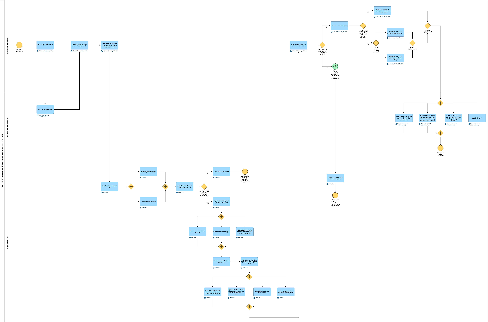
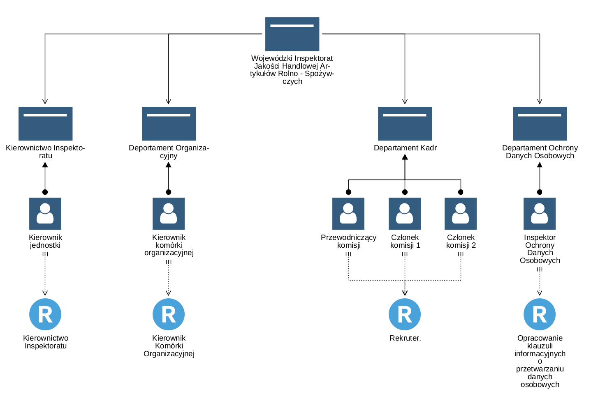
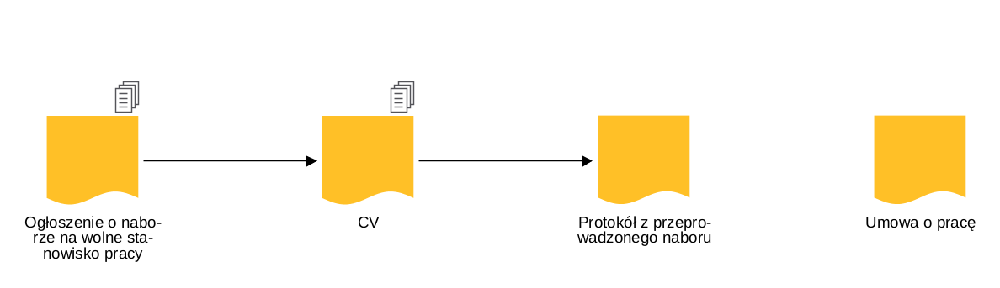

# Proces zatrudnienia pracownika

Projekt przedstawia modelowanie procesu rekrutacji i zatrudnienia nowego pracownika w Wojewódzkim Inspektoracie Jakości Handlowej Artykułów Rolno Spożywczych w Kielcach z wykorzystaniem notacji BPMN. Diagram został stworzony na podstawie opisu procesu zatrudnienia pracownika w pliku `Opis_procedury_zatrudnienia_pracownika.pdf`.  

- **Model środowiska pracy**
Diagram prezentujący środowisko pracy, w tym zasoby i systemy zaangażowane w proces.

- **Model dokumentów**
Wizualizacja przedstawiająca przepływ dokumentów w procesie zatrudnienia.

## Pliki projektu
1. **Diagram BPMN procesów:**
   - `Proces_zatrudnienia_pracownika.bpmn` – plik BPMN przedstawiający szczegółowy model procesu.
   - `Proces_zatrudnienia_pracownika.png` – wizualizacja diagramu BPMN w formacie PNG.

2. **Materiały pomocnicze:**
   - `Model_dokumentów.png` – diagram ilustrujący zarządzanie dokumentami w procesie zatrudnienia.
   - `Model_środowiska_pracy.png` – diagram przedstawiający przygotowanie środowiska pracy dla nowego pracownika.

3. **Dokumentacja:**
   - `Opis_procedury_zatrudnienia_pracownika.pdf` – szczegółowy opis wszystkich kroków i decyzji w procesie procedury zatrudnienia rekrutacji oraz zatrudnienia.
   - `Zatrudnienie_pracownika-opis_diagramu.pdf` – wyjaśnienia i omówienie kluczowych elementów diagramu BPMN oraz ich funkcje w procesie.